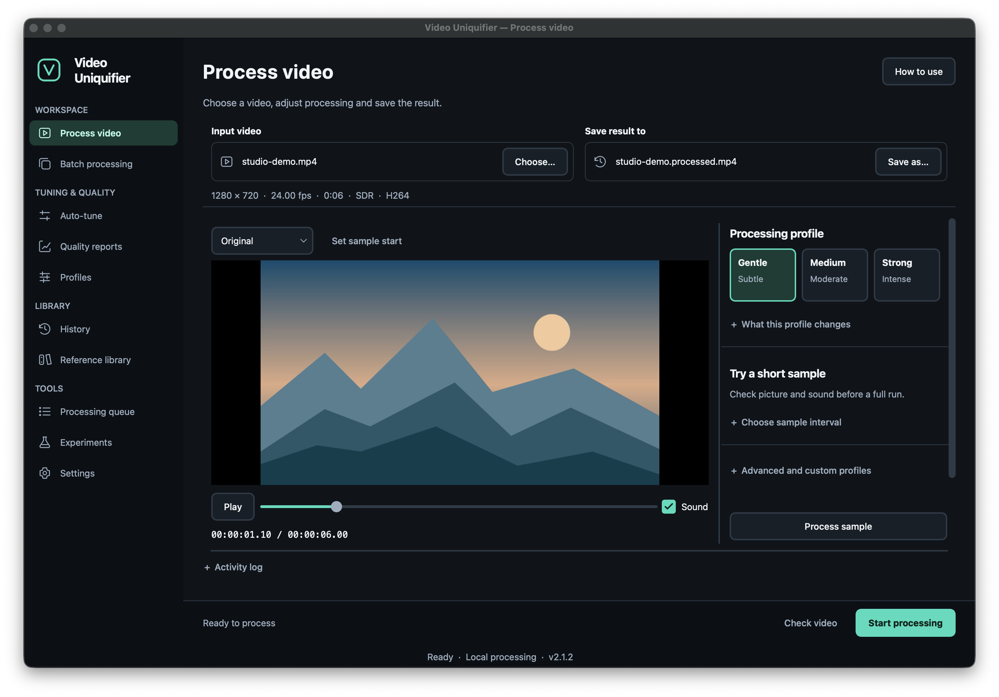

# video-uniquifier

Video processing and re-encoding for content you own or are licensed to use.
Preview changes, compare the result with the original, and process individual
videos or batches through a desktop app, CLI, or web interface.

**Source version: 2.1.2** ·
[Downloads](https://github.com/Hostlife22/video-uniquifier/releases) ·
[Documentation](https://hostlife22.github.io/video-uniquifier/) ·
[Release notes](./CHANGELOG.md)



## Features

- **Desktop workspace:** large video preview, resizable panels, short processed
  samples, and before/after comparison with shared playback and zoom.
- **Processing profiles:** Gentle, Medium, Strong, and custom YAML recipes for
  video and audio changes, with a built-in profile editor.
- **Batch processing:** searchable file lists, status filters, saved history,
  pause/resume, and a shared-filesystem queue for multiple machines.
- **Encoding:** software and hardware encoders, HDR workflows, and configurable
  handling of audio tracks, subtitles, and chapters.
- **Quality reports:** HTML reports with visual and audio diagnostics;
  optional VMAF and SSCD measurements depend on installed tools and models.
- **Interfaces:** English and Russian desktop UI with contextual help,
  a scriptable CLI, and an optional FastAPI web interface with Docker support.

## Install

### Desktop downloads

Choose a published build from
[GitHub Releases](https://github.com/Hostlife22/video-uniquifier/releases).
Desktop bundles include Python and the GUI dependencies.

| Platform | Download | FFmpeg |
| --- | --- | --- |
| Linux x86_64 | AppImage | Included |
| macOS Apple Silicon | macOS ZIP containing the app | Install separately |
| Windows | Windows ZIP containing the executable | Install separately |

See the [installation guide](./docs/install.md) for setup, checksum verification,
first-launch instructions, and installation on Intel Macs.

### From source

Requires Python 3.11+ and `ffmpeg` / `ffprobe` on `PATH`.
On macOS or Linux with `make`:

```bash
git clone https://github.com/Hostlife22/video-uniquifier.git
cd video-uniquifier
make dev PYTHON=python3
make gui
```

Use a Python 3.11+ interpreter for `PYTHON`. Windows setup and optional
dependencies are covered in the [installation guide](./docs/install.md).

## First video

1. Open **Process video**, choose an input, and select where to save the result.
2. Start with **Gentle** and click **Process sample** to review a short fragment.
   Use **Before / after** to compare picture, sound, and synchronization.
3. Click **Start processing** for the full video, then open the result and its
   quality report.

The default sample is 15 seconds; you can choose its start and a 10, 15, or
20-second duration. Sample processing is available for SDR sources.
Each page's **How to use** button, or **F1**, opens its quick guide.
See the [GUI guide](./docs/gui.md) for the full workflow.

### CLI example

From the source checkout on macOS/Linux:

```bash
.venv/bin/video-uniq run input.mp4 \
  --profile src/video_uniquifier/profiles/soft.yaml \
  --out output.mp4
```

The run also writes `output.mp4.qa.html` and `output.mp4.qa.json`.
Open the HTML report in a browser to inspect the measurements.
Use `make cli` for available commands, or add `--help` to a command for its options.

## Profiles

| Desktop choice | YAML profile | Use |
| --- | --- | --- |
| Gentle | `soft.yaml` | Mild changes; a starting point for review |
| Medium | `medium.yaml` | More noticeable processing |
| Strong | `aggressive.yaml` | Experimental processing requiring careful review |

Shipped recipes also cover HDR and common delivery formats, including vertical
and square video. See [Profiles](./docs/profiles.md) for the complete list,
transform settings, and instructions for creating your own recipe.

Quality depends on the source and selected transforms. Review a sample and the
full output; diagnostic scores complement visual and listening checks.

## Documentation

- [Web UI & Docker](./docs/web.md) — browser access and container deployment.
- [Quality reports](./docs/qa_report.md) — measurements and their interpretation.
- [Distributed batch](./docs/distributed.md) — processing across multiple machines.
- [Plugins](./docs/plugins.md) — extending the transform registry.
- [API contracts and naming migration](./docs/api-contracts.md) — Python integration
  and compatibility details.
- [Security policy](./SECURITY.md) — reporting vulnerabilities.

The [documentation site](https://hostlife22.github.io/video-uniquifier/)
contains the full reference and workflow guides.

## Development

```bash
make check        # lint, strict type checking, and tests
make test-unit    # fast unit tests
make build        # desktop bundle
make build-wheel  # Python wheel
```

See [Contributing](./CONTRIBUTING.md) for the development workflow, test
requirements, and contribution guidelines. Run `make help` for all targets.

## License

MIT — see [LICENSE](./LICENSE).
