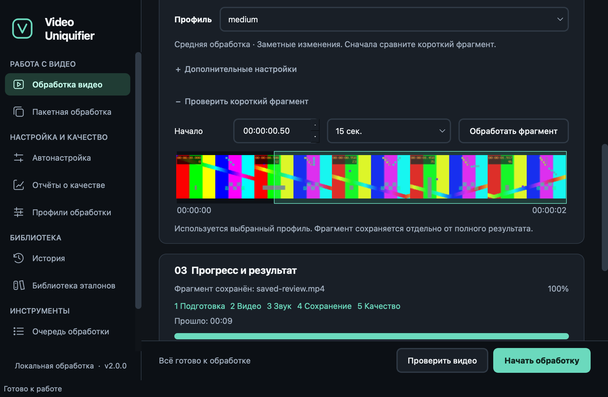
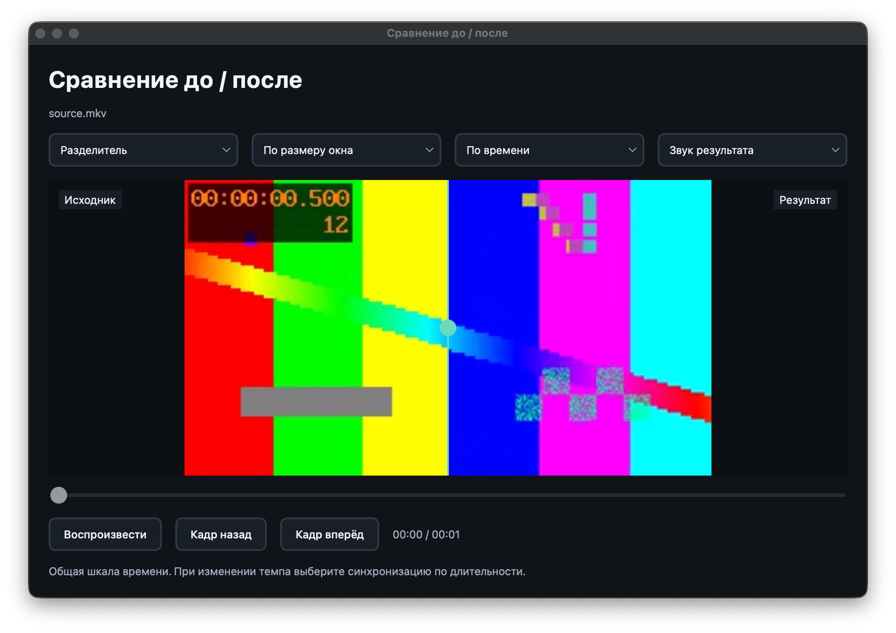
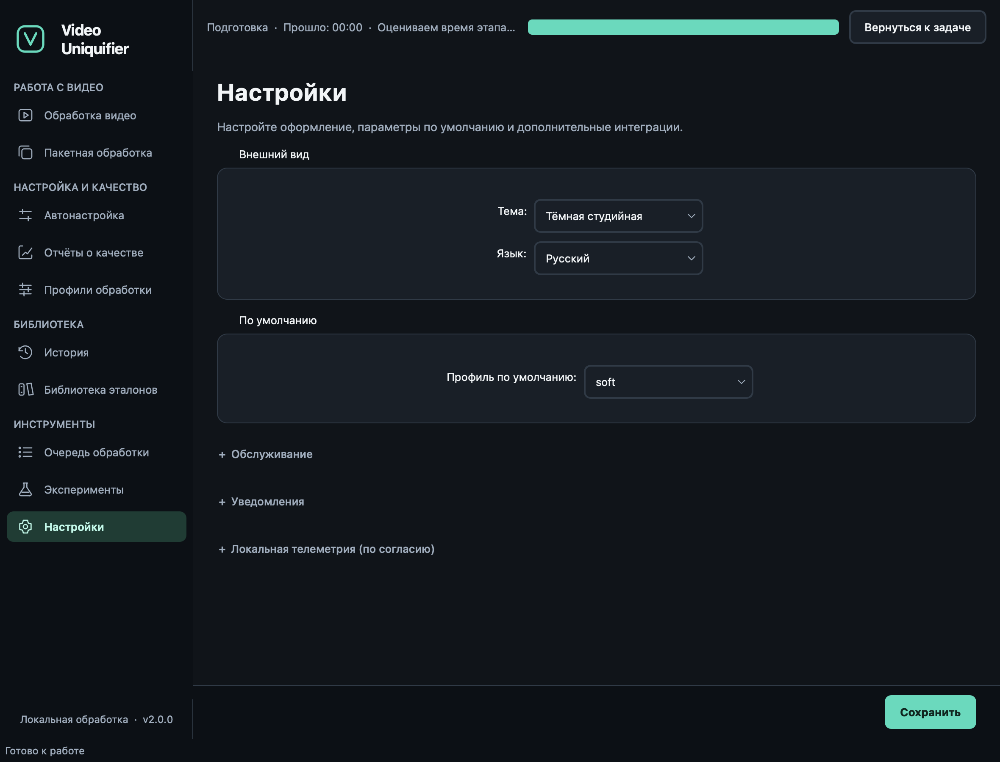

# GUI guide

`video-uniq-gui` is the desktop UI for video-uniquifier. It mirrors the CLI
1:1 — anything you can do from `video-uniq <cmd>` you can do here, plus
some extras (Profile Editor, run History, embedded QA viewer, Validation
wizard).

## Install + launch

```bash
pip install 'video-uniquifier[gui]'
video-uniq-gui
```

`PyQt6-WebEngine` (~150 MB) enables the embedded QA Viewer. If absent
or running headless (e.g. CI smoke), the QA Viewer falls back to a
label + "Open in browser" button.

## Screen overview

The left sidebar groups its ten screens into Workspace, Tuning & Quality,
Library and Tools. Each page has a title and explanation. Dark studio is the
fresh-session default; the light theme shares the same component system. Page
content scrolls in small windows without pushing primary actions off-screen.
Existing preferences remain in effect. Navigation calls each screen's `on_show()`
hook so state stays fresh.

### 1. Process video (Run)

Single-file uniquification.

The **Process video** page has three sections:

1. **Source & destination** — choose or drop a local video. The GUI reads its
   codec, dimensions, frame rate, duration and HDR flag in the background. It
   shows a source thumbnail and suggests `<source>.processed.mp4` next to the input, with a suffix
   if that file exists. Choosing a destination manually preserves that choice
   when the source changes. Source and output cannot be the same path.
2. **Processing** — select a Gentle, Balanced or Pronounced card. Each explains
   the picture and audio effects of the shipped soft, medium or aggressive profile.
   A fresh session starts with `soft`; a saved profile wins. The selector below
   the cards also supports custom profiles. **Advanced settings** contains
   encoder selection, a working **Edit profile** link and auto-tuning.
3. **Progress & result** — follow video/audio progress and segment status.
   Completed runs expose **Open processed video** and **Open quality report**.
   The page scrolls to these actions when processing finishes. **Measured
   metrics** is a separate collapsed block for the diagnostic values.
   The video action keeps the completed path even if the next destination changes.

The fixed action bar explains what is missing and provides **Check video** and
**Start processing** (`Ctrl+P` / `Ctrl+R`). Checks are also enforced by the
processing pipeline. A blocking finding stays active until input/profile/encoder
changes; results from older settings are discarded. During processing the input
controls are disabled and **Pause** / **Cancel** become available.

**Preview original** opens an embedded player without processing the source.
Its **Use this time for sample** button selects the current playback position.
Expand **Test a short fragment**, choose the start on the thumbnail filmstrip or
enter `HH:MM:SS.cc`, select a 10, 15 or 20-second length, then click **Process sample**.
The filmstrip decodes five small frames in a cancellable background worker;
click or drag to select a start, or use arrow keys to move by a second.
The selection is shortened at
the end of a shorter source. A lossless FFV1/PCM reference is processed through
the selected profile and the normal processing/QA pipeline. The full destination
and run history stay unchanged. **Save sample…** copies the processed MP4 to a
chosen location; saved copies remain available after the application closes.
Saving is cancellable and atomic, and cannot overwrite the original source or
temporary review files, including aliases via symlinks or hardlinks. Unsaved
samples are temporary: creating another sample or closing the application removes
them. HDR samples are disabled because this
reference format cannot guarantee preservation of all HDR metadata; full-file
processing remains available.



When a sample finishes, **Before / after** opens automatically. Completed full
runs expose **Compare before / after**. Both players share play/pause and a
timeline; only the selected soundtrack is heard. Choose side-by-side, original
or result, or **Draggable divider**. The divider overlays two SDR frames on the
same canvas: drag its handle or use Left/Right, Home and End. It shows the source
on the left and the result on the right; crop/rotation differences remain visible.
Known PQ/HLG HDR frames use the native video panels instead of the raster divider.
Choose fit-to-window, 50%, **100%**, 200% or 400% (100% is one decoded pixel per
physical screen pixel). Drag zoomed pictures to pan; the divider shares the same
offset for both images, while side-by-side panels synchronize scroll fractions.
Frame buttons pause and use nearby decoded timestamps,
including variable-rate frames. **Sync by time** uses the common time range;
**Sync by duration** also maps times and playback rates for constant tempo
changes. These modes do not register matching scenes after arbitrary edits.
If a codec is unavailable in the native player, its error appears in the window;
the existing **Open processed video** action still opens the system player.



Processing identifies preparation, video, audio, saving and quality-check stages.
The percentage describes the current stage or observed audio pass, rather than
an invented percentage of the entire job. Elapsed time excludes pauses. The
remaining-time estimate applies to the current stage and appears only after
several advancing measurements; it resets for new stages, metric passes and
retries, and disappears when progress stalls or has no measurable fraction.

A global activity banner stays above the page when a run, sample, sample save,
auto-tune, batch or queue worker is active. Navigate freely and use **Return to
task** to reopen its screen. When several workflows are active, select the task
in the banner. Unknown progress uses an indeterminate bar, and completed tasks
leave the banner automatically.



**Activity log** is collapsed initially and opens automatically when an error is
logged. It can also be expanded with the keyboard. Automatic encoder selection
remains available; a manual choice is passed to the existing core API.

The expanded metrics use responsive KPI pills colour-coded per band:
- **pHash worst chunk** — green < 0.75, yellow < 0.85, red ≥ 0.85
- **VMAF mean** — green ≥ 85, yellow ≥ 75, red < 75
- **Audio FP Hamming** — green ≥ 18 bits, yellow ≥ 10 bits, red < 10
- **Similarity max** — legacy display bands: green < 0.2, yellow < 0.4, red ≥ 0.4

These colors are local diagnostic display bands, not probabilities, human quality
bands or predicted Content ID outcomes. Missing measurements display `n/a`.

### 2. Batch processing

Directory-of-files iterator. Pick input dir + output dir + glob
pattern (default `*.mp4`) + profile + encoder. The matched files preview
in a table; click ▶ Run batch and each row updates its status
(pending → running → done / failed) as the worker progresses.

"Continue on error" keeps the batch going past per-file failures (the
default); uncheck to stop on the first failure.

### 3. Auto-tune (Calibrate)

Search profile intensity against a target self-match. Pick source +
base profile + target self-match (default 0.2) + min quality (default
88) + iterations (default 5) + total probe seconds (default 60, spread
across start/middle/end). The chart plots three series per trial:
`intensity_factor`, `self_match`, `quality / 100`. When done, click
"Save tuned profile as…" to write the result.

If the calibrate loop didn't converge ("⚠ best-so-far"), the saved
profile is the lowest-violation candidate seen, but it did not pass both
constraints. Inspect the reported VMAF/SSIM backend and candidates before
changing the clip budget, base profile, or threshold.

### 4. Quality reports (QA Viewer)

Two modes:
- **Open existing** — pick any `.qa.html` and render it embedded.
- **Compute new** — pick (input, output) pair and compute the report
  inline. Output paths are written next to the output file as
  `<output>.mp4.qa.json` / `.qa.html`.

### 5. Profiles (Profile Editor)

Inline YAML profile editing. Pick a profile from the dropdown; the
transforms table loads with three columns:
- transform id (red if not in the current registry)
- enabled checkbox
- params as JSON (editable)

Top-level `seed_strategy` selector below. Effects and live YAML preview occupy
separate tabs, keeping the editor readable in a narrow window. "Save" overwrites with a `.yaml.bak` backup; "Save as…" prompts
for a new path.

Invalid JSON in any params cell prevents save and shows a QMessageBox
with the row number.

### 6. History

Last 100 runs (capped, persisted to
`~/.config/video_uniquifier/history.json`). Per-row "Open output" + "QA"
buttons. Filter box matches across source / profile / encoder /
status. "Clear all" wipes the file.

### 7. Corpus

CRUD over the local fingerprint index. Add a file → CorpusWorker
indexes it in the background (multi-second per long video). Remove
selected rows by ID.

### 8. Queue

Two sub-tabs:
- **Queue management** — pick the queue root (must be on a shared FS
  with atomic-rename support), "Init queue here" creates pending/
  in_progress/ done/ failed/, "Add files…" hardlink-copies files into
  pending/, live stats banner refreshes every 2 s.
- **Worker control** — start a single-process QueueWorker drainer:
  lease → run_full → release_done/failed. Stop is a cooperative
  cancel.

### 9. Validation

3-step wizard for the v0.4.1 real-CID validation harness:
- **Generate** — N variants of one source. Calls
  GenerateVariantsWorker (wraps `tools/generate_variants.py`).
- **Record** — editable table with per-variant local diagnostic KPIs +
  empty cells for `upload_date`, `youtube_video_id`, `match_status`,
  `notes`. "Save to validation_log.csv" appends.
- **Analyze** — runs `python tools/validation_correlate.py` against
  the CSV and shows the output (Spearman correlation per predictor).

Manual upload between steps 1 and 2: see
[docs/validation_harness.md](./validation_harness.md) for the full
loop.

### 10. Settings

- **Theme** — dark / light / system (system falls back to dark in MVP);
  live-applies via state.theme_changed signal.
- **Default profile** — pre-selected on Process video and Batch processing
  at startup. Auto-tune has its own base-profile selector.
- **Maintenance** — Reset encoder cache (deletes
  `~/.cache/video_uniquifier/encoders.json`), Open log dir, Open config dir.

## Keyboard shortcuts

All primary CTAs and sidebar navigation are keyboard-reachable. Screen-
reader users can rely on `setAccessibleName` + `setAccessibleDescription`
on every interactive widget (regression test:
`tests/unit/test_gui_accessibility.py`).

### Global navigation

| Shortcut | Action |
|---|---|
| Cmd/Ctrl+1..0 | Switch to sidebar entry 1..10 (v0.7.0) |
| Cmd/Ctrl+W   | Close window |
| Cmd/Ctrl+Q   | Quit |

### Run screen

| Shortcut | Action |
|---|---|
| Cmd/Ctrl+R | **Run** — start the encode (alias: mnemonic `&Run`) |
| Esc        | **Cancel** — stop at the next safe boundary (alias: mnemonic `&Cancel`) |
| Space      | **Pause / Resume** — suspend the running ffmpeg subprocess and freeze segment progress; long pauses (>24h) auto-cancel (v0.7.0 R6 / F5) |
| Cmd/Ctrl+T | **Auto-tune** — calibrate the selected profile against this input, save as `<profile>.tuned.yaml`, switch to it (v0.7.0 R4 / F7) |
| Cmd/Ctrl+Q | **Open QA report** — open the HTML report from the most recent run |
| Cmd/Ctrl+P | **Preflight** — re-run preflight checks against the current source |

### Settings screen

| Shortcut | Action |
|---|---|
| Cmd/Ctrl+, | **Open Settings** |

### Notifications (Settings → Post-job notifications)

The Settings screen carries a **Test** button per notifications channel
(v0.7.0 R5 / F4) that synthesises a `completed` event and dispatches it
via `core.notifications.dispatch` — handy for verifying webhook URLs +
SMTP creds without running a full encode.

## Where data lives

Resolved via `QStandardPaths.AppConfigLocation` + `CacheLocation` (v0.7.0
R1 / E3) so paths follow each OS's convention. A migration helper copies
previous application settings/history on first launch, keeping the originals.

| Path (typical) | OS conv. | What |
|---|---|---|
| `<CONFIG_DIR>/state.json`            | macOS `~/Library/Preferences/video-uniquifier`, Linux `~/.config/video-uniquifier`, Windows `%APPDATA%\video-uniquifier` | Theme, recents, default profile/encoder, notifications config |
| `<CONFIG_DIR>/history.json`          | same as above | Run history (≤100 entries) |
| `<CONFIG_DIR>/crash.log`             | same as above | Global excepthook trace log (100 KiB rotation, v0.7.0 R2 / E6) |
| `<CACHE_DIR>/encoders.json`          | macOS `~/Library/Caches/video-uniquifier`, Linux `~/.cache/video-uniquifier`, Windows `%LOCALAPPDATA%\video-uniquifier\Cache` | Encoder detection cache (resettable from Settings) |
| `<CACHE_DIR>/work/<plan_hash>/`      | same as above | Run work_dir (segments, state.json, resume marker) |
| `<CACHE_DIR>/keyframes/`             | same as above | Keyframe scan cache (30-day TTL) |
| `<CACHE_DIR>/corpus/index.json`      | same as above | Corpus fingerprint index |
| `<CACHE_DIR>/batch/<plan_hash>/`     | same as above | Batch worker scratch |
| `<CACHE_DIR>/worker/<plan_hash>/`    | same as above | Queue worker scratch |

## Packaging

A starter `pyinstaller/video-uniq-gui.spec` is shipped. On macOS:

```bash
pip install pyinstaller
pyinstaller pyinstaller/video-uniq-gui.spec --clean --noconfirm
open dist/video-uniq-gui.app    # unsigned: right-click → Open first time
```

On Windows / Linux PyInstaller can also produce a one-file
distribution. If PyInstaller fails on your platform, the fallback is
always `pipx install 'video-uniquifier[gui]'` which works everywhere.

## Troubleshooting

**Q: PyQt6 not installing on my Linux.**
A: Some distros need `apt install libxcb-cursor0 libgl1` before
PyQt6's binary wheel works.

**Q: QA Viewer shows a label instead of the embedded report.**
A: Either `PyQt6-WebEngine` isn't installed (`pip install
'video-uniquifier[gui]'`) or you're running headless (offscreen Qt forces
the label fallback because the embedded browser crashes there).

**Q: Encoders look wrong / unavailable.**
A: Settings → Reset encoder cache. Next launch re-probes.
